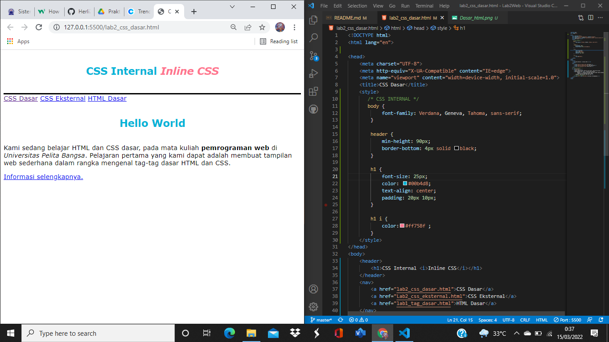
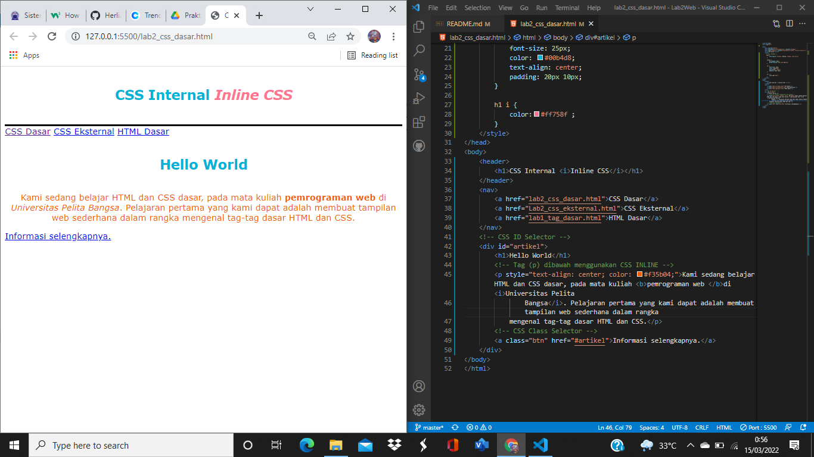
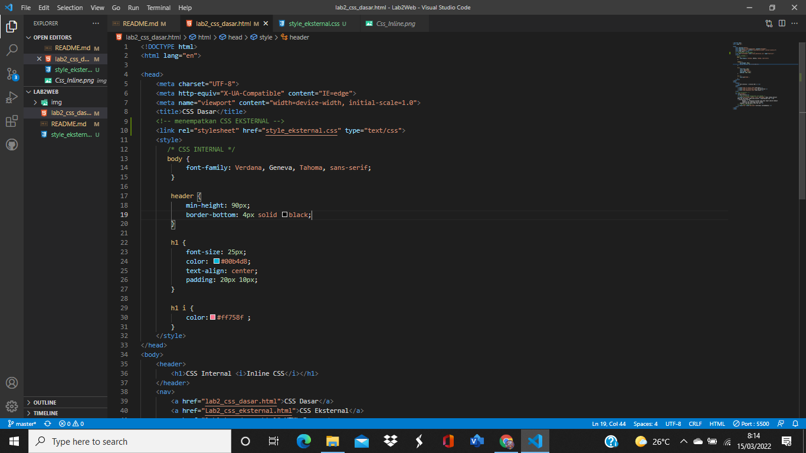
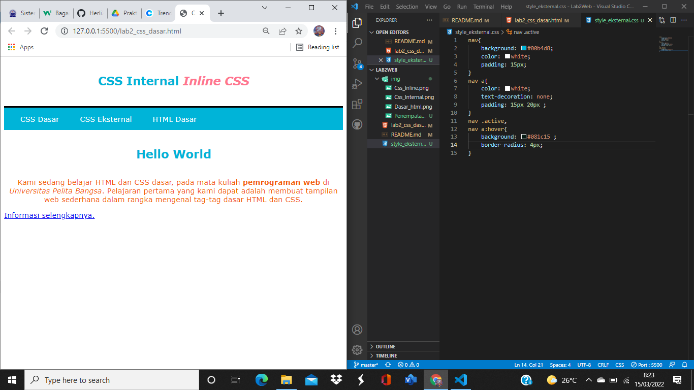
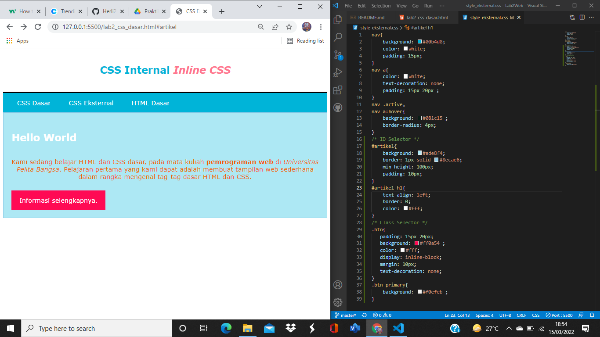
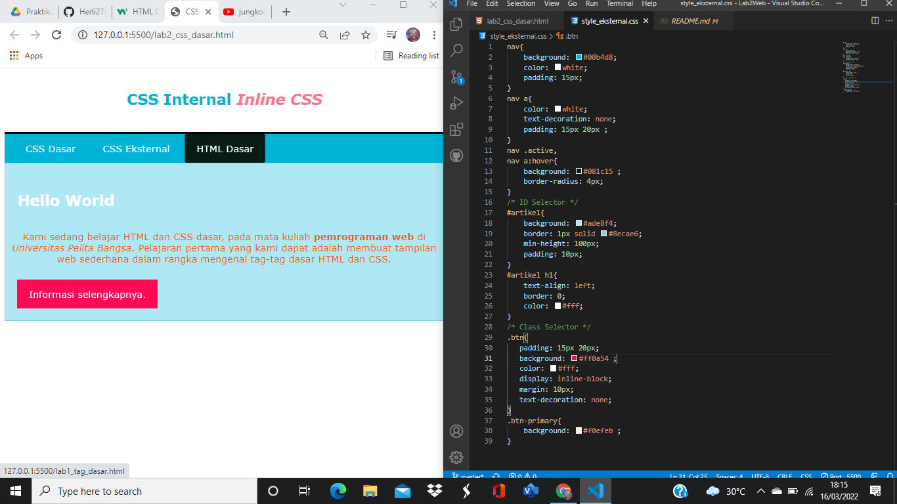
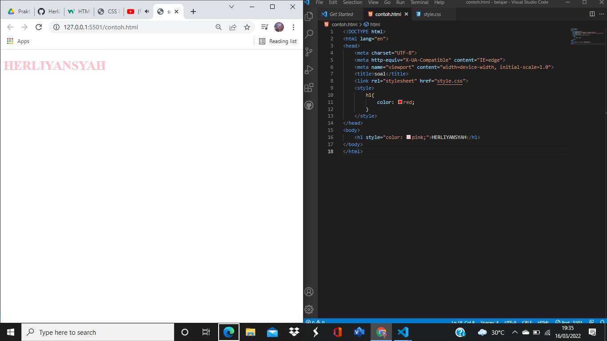
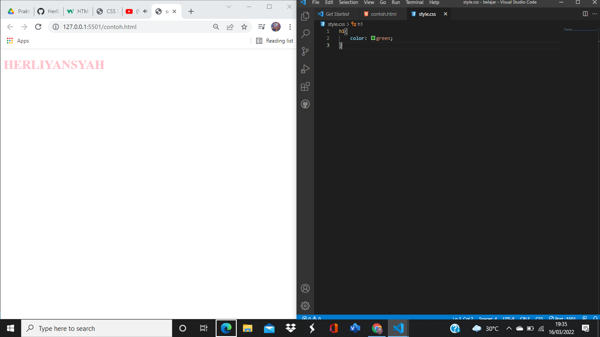
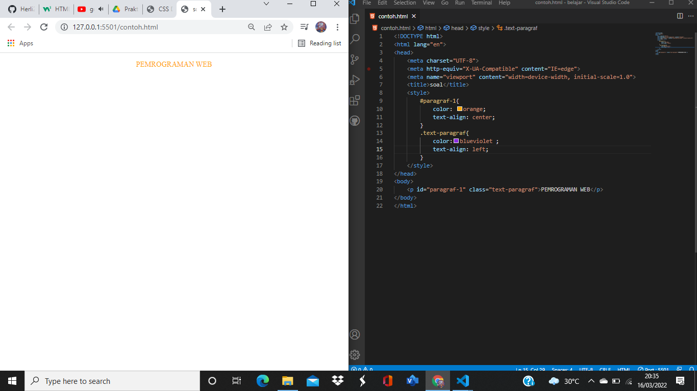

| HERLIYANSYAH      | 312010387         |
|------------------ |-------------      |
|    TI.20.A.2      | PEMROGRAMAN WEB   |
|     HTML          |    CSS            |

# Lab2Web
### Pertemuan 3
untuk mata kuliah kali ini membahas tentang membuat website dengan html dan css dasar seperti CSS ***inline***, ***internal*** dan juga ***eksternal*** serta selector **ID** dan juga **Class**

## 1). Langkah pertama buat dokumen dasar HTML
### Contoh code beserta hasil nya sebagai berikut!


disini terdapat sebuah dokumen dasar html namun belum beserta CSS atau hanya masih file html dasar nya saja,belum diberi CSS ***inline*** **internal** atau pun **eksternal**.

## Source code
```html
<!DOCTYPE html>
<html lang="en">

<head>
    <meta charset="UTF-8">
    <meta http-equiv="X-UA-Compatible" content="IE=edge">
    <meta name="viewport" content="width=device-width, initial-scale=1.0">
    <title>CSS Dasar</title>
</head>
<body>
    <header>
        <h1>CSS Internal <i>Inline CSS</i></h1>
    </header>
    <nav>
        <a href="lab2_css_dasar.html">CSS Dasar</a>
        <a href="Lab2_css_eksternal.html">CSS Eksternal</a>
        <a href="lab1_tag_dasar.html">HTML Dasar</a>
    </nav>
    <!-- CSS ID Selector -->
    <div id="artikel">
        <h1>Hello World</h1>
        <p>Kami sedang belajar HTML dan CSS dasar, pada mata kuliah <b>pemrograman web </b>di <i>Universitas Pelita
                Bangsa</i>. Pelajaran pertama yang kami dapat adalah membuat tampilan web sederhana dalam rangka
            mengenal tag-tag dasar HTML dan CSS.</p>
        <!-- CSS Class Selector -->
        <a class="btn" href="#artikel">Informasi selengkapnya.</a>
    </div>
</body>
</html>
```
## 2). MENDEKLARASIKAN CSS INTERNAL
### Contoh code beserta hasil nya dan juga penempatan CSS nya

**PENJELASAN**                                             

CSS INTERNAL dia adalah CSS yang ditempat kan di dalam file html tepat nya dibagian **head** pada html,dengan mendeklarasikan code **style** Gambar di atas adalah contoh bagaimana menempatkan CSS internal dan juga hasil dari perubahan dengan menggunakan CSS internal dan juga menambahkan Style seperti (Color) (padding) (border-bottom) untuk merubah nya agar lebih hidup dan menarik

## Source Code

```css
    <style>
       /* CSS INTERNAL */
       body {
            font-family: Verdana, Geneva, Tahoma, sans-serif;
        }

        header {
            min-height: 90px;
            border-bottom: 4px solid black;
        }

        h1 {
            font-size: 25px;
            color: #00b4d8;
            text-align: center;
            padding: 20px 10px;
        }

        h1 i {
            color:#ff758f ;
        }
    </style>
```
### NOTE (Saya memilih warna sesuai kesukaan saya)

## 3). MENAMBAHKAN INLINE CSS 
### Contoh code beserta hasil nya dan juga penempatan CSS nya!

**PENJELASAN**     

CSS ***INLINE*** sendiri yaitu CSS yang pendeklarasian nya ada pada tag html nya sendiri dengan menggunakan **style** seperti contoh di atas ,saya mendeklrasikan CSS ***INLINE*** pada tag (p) dengan Property (text-align) dan juga (color) CSS ***INLINE*** sendiri sangat spesifik dia hanyan merubah pada tag yang hanya diberi **style** CSS ***INLINE*** sangat kuat maksud nya yaitu jika kita melakukan code yang sama dengan deklarasi yang berbeda yang terpanggil hanya ***INLINE*** karena ***INLINE*** memiliki prioritas tinggi dibanding ***INTERNAL*** atau pun ***EKSTERNAL*** begitu kurang lebih penjelasan tentang CSS ***INLINE***

## Source Code
```html
<!-- Tag (p) dibawah menggunakan CSS INLINE -->
        <p style="text-align: center; color: #f35b04;">Kami sedang belajar HTML dan CSS dasar, pada mata kuliah <b>pemrograman web </b>di <i>Universitas Pelita
                Bangsa</i>. Pelajaran pertama yang kami dapat adalah membuat tampilan web sederhana dalam rangka
            mengenal tag-tag dasar HTML dan CSS.</p>
```

## 4). MEMBUAT CSS EKSTERNAL
### Contoh code dan penempatan CSS EKSTERNAL


Tepat pada **LINE CODE 10** di dalam **head** link CSS ***EKSTERNAL*** saya tempatkan.   
Kemudian buat file CSS terlebih dahulu seperti contoh saya yaitu **style_eksternal.css** dan mulai mengoding css di file itu.

### Contoh code beserta hasil nya

**PENJELASAN**

CSS ***EKSTERNAL*** adalah CSS yang dimana file nya terpisah dengan html itu sendiri dengan melalui link penempatan nya,CSS  ***EKSTERNAL*** sangat direkomendasikan oleh para programmer website developer dalam membuat gaya pada CSS,Karena 1 file CSS ***EKSTERNAL*** bisa untuk banyak file HTML,itu mengapa sangat direkomendasikan banyak programmer kelebihan dari CSS ***EKSTERNAL*** di (a:hover) saya sedikit menambahkan (Border-Radius: 4px;) agar terlihat menarik.

## Source Code
```css
nav{
    background: #00b4d8;
    color: white;
    padding: 15px;
}
nav a{
    color: white;
    text-decoration: none;
    padding: 15px 20px ;
}
nav .active,
nav a:hover{
    background: #081c15 ;
    border-radius: 4px;
}
```
## 5). MENAMBAHKAN CSS SELECTOR
### Contoh Code dan juga Selector ID dan Class nya

**PENJELASAN**

CSS Selector adalah sebuah pendeklarasian untuk menambahkan gaya pada element HTML seperti selector **(p)** **(h1)** dll,ada juga Selector ID yang pendeklarasian nya dalam file CSS yaitu **(#)** kemudian definisikan property CSS dalam kurung Seperti contoh **#nav** itu adalah contoh pendeklarasian nya yang arti nya **nav** akan diberi tampilan CSS
Selain itu ada juga Selector **Class** sama seperti **ID** **Class** juga dapat sebagai mana yang akan diberi gaya pada CSS namun yang membedakan nya yaitu pendeklarasian nya jika **ID** itu **(#)** maka **Class** **(.)** atau titik Seperti contoh di file CSS nya **.artikel** yang diberi Class akan di ubah.

## Source Code
```css
/* ID Selector */
#artikel{
    background: #ade8f4;
    border: 1px solid #8ecae6;
    min-height: 100px;
    padding: 10px;
}
#artikel h1{
    text-align: left;
    border: 0;
    color: #fff;
}
/* Class Selector */
.btn{
   padding: 15px 20px; 
   background: #ff0a54 ;
   color: #fff;
   display: inline-block;
   margin: 10px;
   text-decoration: none;
}
.btn-primary{
    background: #f0efeb ;
}
```
 
## PERTANYAAN DAN TUGAS!

### 1). Lakukan Eksperimen dengan mengubah dan menambah properti dan nilai pada kode CSS  dengan mengacu pada CSS Cheat Sheet yang diberikan pada file terpisah  dari modul ini.                                       
---------------------------------------------------------------------------

**JAWABAN**  


Disitu saya menambahkan **Border-radius:4px;** pada nav a:hover nya,karena agar terlihat lebih rapih contoh 
```css
border-radius: 4px;
```
dan juga saya menambahkan warna h1 dengan menggunakan selector **ID** untuk mengubah warna padding dan text-align contoh
```css
#artikel{
    background: #ade8f4;
    border: 1px solid #8ecae6;
    min-height: 100px;
    padding: 10px;
}
#artikel h1{
    text-align: left;
    border: 0;
    color: #fff;
```
### 2). Apa perbedaan pendeklarasian CSS elemen {h1} dengan {#intro h1} berikan penjelasan nya!
-----------------------------------------------------------------------------

**JAWABAN**

  Jadi jika hanya mendeklarasian elemen **{h1}** saja berarti semua elemen **{h1}** akan berubah oleh CSS Sedangkan jika mendeklarasikan **{#intro h1}** hanya elemen h1 dengan deklrasi **{#intro h1}** saja yang berubah,karena **ID** itu unik.

  ### 3). Apabila ada  deklrasi CSS secara internal,lalu ditambahkan CSS Eksternal dan inline CSS pada elemen yang sama. Deklarasi manakah yang akan ditampilkan pada browser ? Berikan penjelasan dan contoh nya!
----------------------------------------------------------------------------------------------                                                                    

**JAWABAN**

Ketika kita mendeklarasikan secara bersamaan antara ***INTERNAL*** ***EKSTERNAL*** dan ***INLINE*** yang akan ditampilkan pada Browser adalah **INLINE** Karena **INLINE** Memiliki prioritas dibanding ***EKSTERNAL*** atau pun ***INTERNAL*** seperti contoh yang saya buat,saya membuat dokumen baru HTML kemudian saya buat Elemen ***{h1}*** yang kemudian saya akan deklarasikan di CSS ***INTERNAL*** ***EKSTERNAL*** dan juga ***INLINE*** Dengan property ***{color}*** dengan warna yang berbeda,jika ***INTERNAL*** {color: red} sementara ***EKSTERNAL*** {color:green;} dan ***INLINE*** {color: pink;} yang terpanggil dibrowser adalah ***INLINE*** karena memiliki prioritas.

## Contoh Hasil dan Code

**DI ATAS ADALAH DEKLARASI INLINE DAN INTERNAL SEMENTARA FOTO DIBAWAH ADALAH DEKLARASI EKSTERNAL NYA**



jadi yang terpanggil adalah ***CSS INLINE*** karena memiliki prioritas tinggi dibanding CSS deklarasi lain nya.

### 4). Pada sebuah elemen HTML terdapat ID dan Class,apabila masing-masing selector tersebut  terdapat deklarasi CSS , maka deklarasi manakah yang akan ditampilkan pada browser? Berikan penjelasan dan contohnya! 
```html
(<p id="paragraf-1" class="text-paragraf">)
```
----------------------------------------------------------------------------------------------

**JAWABAN**

Yang terpanggil dibrowser adalah **ID** karena **ID** bersifat unik berbeda dengan **Class** **Class** bisa digunakan banyak sementara **ID** hanya tertentu saja itu kenapa **ID** unik dan yang terpanggil di browser adalah **ID** .

## Contoh hasil dan Code nya



Disitu saya menambahkan property {color} dan {text-align} untuk **ID** {color: orange} dan {text-align: center} sementara **Class** yaitu {color:blueviolet} dan {text-align: left} namun yang terpanggil di browser adalah **ID** yang property nya {color: orange} dan juga {text-align: center} 


## UNTUK PRAKTIKUM KALI INI CUKUP SAMPAI DISINI SAMPAI BERTEMU DIPERTEMUAN BERIKUT NYA 
# **TERIMA KASIH**
