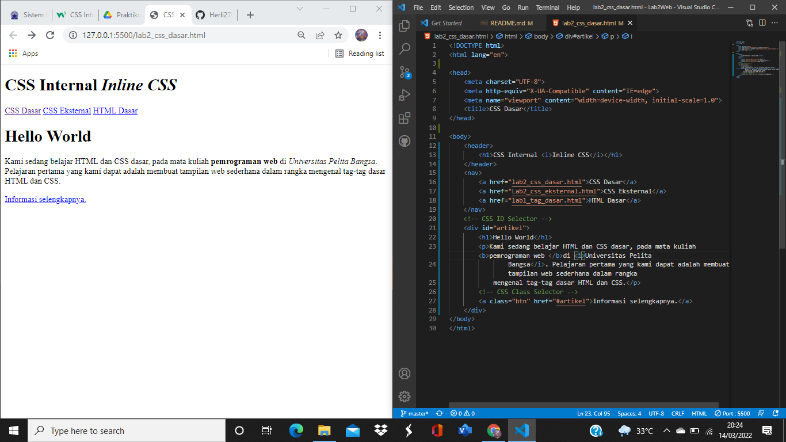

| HERLIYANSYAH      | 312010387         |
|------------------ |-------------      |
|    TI.20.A.2      | PEMROGRAMAN WEB   |
|     HTML          |    CSS            |

# Lab2Web
### Pertemuan 3
untuk mata kuliah kali ini membahas tentang membuat website dengan html dan css dasar seperti CSS ***inline***, ***internal*** dan juga ***eksternal*** serta selector **ID** dan juga **Class**

## 1). Langkah pertama buat dokumen dasar HTML
### Contoh code beserta hasil nya sebagai berikut!


disini terdapat sebuah dokumen dasar html namun belum beserta CSS atau hanya masih file html dasar nya saja,belum diberi CSS ***inline*** **internal** atau pun **eksternal**.

## Source code
```html
<!DOCTYPE html>
<html lang="en">

<head>
    <meta charset="UTF-8">
    <meta http-equiv="X-UA-Compatible" content="IE=edge">
    <meta name="viewport" content="width=device-width, initial-scale=1.0">
    <title>CSS Dasar</title>
</head>
<body>
    <header>
        <h1>CSS Internal <i>Inline CSS</i></h1>
    </header>
    <nav>
        <a href="lab2_css_dasar.html">CSS Dasar</a>
        <a href="Lab2_css_eksternal.html">CSS Eksternal</a>
        <a href="lab1_tag_dasar.html">HTML Dasar</a>
    </nav>
    <!-- CSS ID Selector -->
    <div id="artikel">
        <h1>Hello World</h1>
        <p>Kami sedang belajar HTML dan CSS dasar, pada mata kuliah <b>pemrograman web </b>di <i>Universitas Pelita
                Bangsa</i>. Pelajaran pertama yang kami dapat adalah membuat tampilan web sederhana dalam rangka
            mengenal tag-tag dasar HTML dan CSS.</p>
        <!-- CSS Class Selector -->
        <a class="btn" href="#artikel">Informasi selengkapnya.</a>
    </div>
</body>
</html>
```
## 2). MENDEKLARASIKAN CSS INTERNAL
### Contoh code beserta hasil nya dan juga penempatan CSS nya

**PENJELASAN**                                             

CSS INTERNAL dia adalah CSS yang ditempat kan di dalam file html tepat nya dibagian **head** pada html,dengan mendeklarasikan code **style** Gambar di atas adalah contoh bagaimana menempatkan CSS internal dan juga hasil dari perubahan dengan menggunakan CSS internal dan juga menambahkan Style seperti (Color) (padding) (border-bottom) untuk merubah nya agar lebih hidup dan menarik

## Source Code

```css
    <style>
       /* CSS INTERNAL */
       body {
            font-family: Verdana, Geneva, Tahoma, sans-serif;
        }

        header {
            min-height: 90px;
            border-bottom: 4px solid black;
        }

        h1 {
            font-size: 25px;
            color: #00b4d8;
            text-align: center;
            padding: 20px 10px;
        }

        h1 i {
            color:#ff758f ;
        }
    </style>
```
### NOTE (Saya memilih warna sesuai kesukaan saya)


